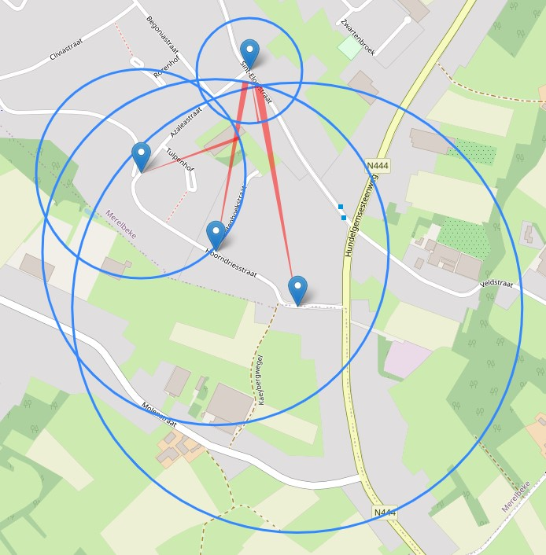
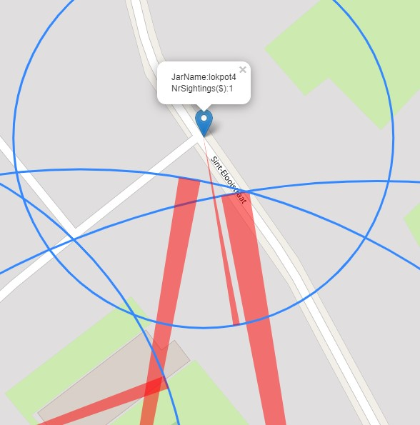

<p align="center">
  
</p>


#Welcome to the Asian Hornet Tracker tool

This project started as a necessity to track, monitor and create a 'tracking' map with the necessary data.

### Changes
- csv upload only possible with clear text
- added SQL Lite database
- added KISS frontend
- basic data CRUD operations (Add, Delete , Update)

## How does it work? 

Basically the following Python projects are in use:
- Python 3.x
- Flask
- Folium
- Pandas
- Folium Plugins SemiCircle

And some modding is performed using a nice guys work : https://stackoverflow.com/questions/57227249/folium-how-can-i-change-fill-color-in-semicircle-plugin

The data is in a csv file. This means it is a comma separated set of data. You need to keep the order ;-).
Only then the program can read and understand the input. 


> Install the latest version of Python
> for Windows users: go to the webpage of Python and follow the install instructions.
> Normally your system has already pip in it. 

> In terminal pip install the requirements file
> '''
> pip install -r requirements.txt
> '''
---
> Run the code by opening a cmd or terminal window.

[//]: <> (Inserting Code)
```
inside the terminal: browse to your program folder.
 For windows user probably :> c:/User/something/downloads/... 
type:
python main.py

this should run the Flask server.
```
> click on the URL inside the terminal window.
> open the http://127.0.0.1:5000
> This opens the webpage program.

### Database Data

The Database is hidden. So booting the system requires a new database. Should be tested. It is a lite sql solution.

---

**jar** :  the name of the jar , can be a string (Just give it a name to remember)

**latitude**: You need to know the geolocation of the jar (I use Google maps and copy the information)

**longitude**: Same as above

**nr_of_sightings**: would be useful to know at which yar you have seen the most hornets.

**average_distance**: when measuring the flight time between departure and return, you known the distance (1 min = 100 meters)

**heading_direction**: for this you need a compass. :-) just add it in degrees.

---

With the forms you can edit and add information. 

### CSV Bulk data upload

You can now upload CSV data as long string. It saves you a lot of time.
An Example of the data is inside the text field visible. You can use that example for your own upload.

### For now
> After installation of the requirements file. 
> 
> Run the python main.py.
> 
> A local 'web interface' is created.
> 
> Open the url = > http://127.0.0.1:5000
> 
> On the left is the menu to jump between jars and maps. The generator generates the map :-)
> 
> Every Jar or Map is a form where you can perform CRUD operations. 
> This means, that you can add, read, update and read information in the database. 
> I think that the "blocks" in the form are understandable. 


### Improvements?
Well, be my guest. 
I intend to add a form to the interface, so you can add and change the csv file. If someone has better knowledge
of Flask or HTML and who can/will generate a front end. Please do so. It will be greatly appreciated.
- added table buttons to upload directly information on a map. 
- added table buttons to delete data -> **it still has an error**
- better formatting of the frontend with bootstrap.

planned:
- Nicer Frontend - done
- Listing of information within frontend
- Someone to help with frontend
- Testing crowd
- putting it online

### Images






### Probably some issues
- Do you have enough rights on your machine?
- Have you read the installation instructions?
- Is the use of a local web server allowed on your machine? 
- Check if your firewall is not blocking port 5000

### Special Care for semicircle.py: !!! Do not forget this !!!
I copied the information from the URL and replaced the main file of folium plugins.
After installation of the folium with pip, find the original semicircle.py and replace it with this one.
