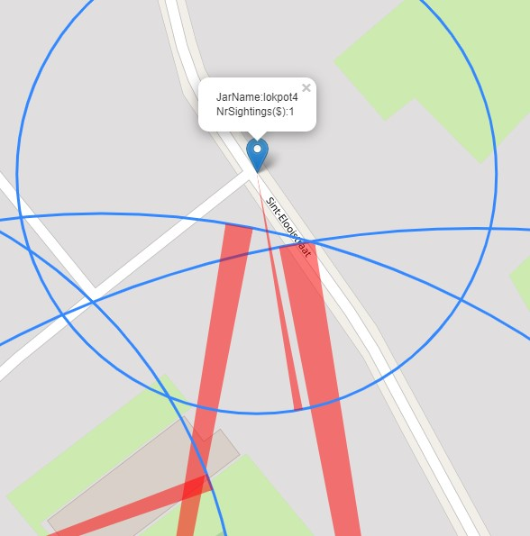

<p align="center">
  
</p>


#Welcome to the Asian Hornet Tracker tool

This project started as a necessity to track, monitor and create a 'tracking' map with the necessary data.
Monitoring information is now sorted in a csv file. This is in fact your data. 
Then the Python is importing the information and uses the folium solution to create a map with the csv data.

## How does it work? 

Basically the following Python projects are in use:
- Python 3.x
- Flask
- Folium
- Pandas
- Folium Plugins SemiCircle

And some modding is perfomed using a nice guys work : https://stackoverflow.com/questions/57227249/folium-how-can-i-change-fill-color-in-semicircle-plugin

The data is in a csv file. This means it is a comma seperated set of data. You need to keep the order ;-).
Only then the program can read and understand the input. 


> Install latest version of Python

> In terminal pip install the requirements file
> '''
> pip install -r requirements.txt
> '''
---
Run the code

This starts the web page.

[//]: <> (Inserting Code)
```
terminal:python main.py
```

> open the http://127.0.0.1:5000


### CSV Data

The CSV file is hidden in the folder **Tracking Data**. Just open the file and add your information.

**jar** :  the name of the jar , can be a string (Just give it a name to remember)

**latitude**: You need to know the geolocation of the jar (I use Google maps and copy the information)

**longitude**: Same as above

**nr_of_sightings**: would be useful to know at which yar you have seen the most hornets.

**average_distance**: when measuring the flight time between departure and return, you known the distance (1 min = 100 meters)

**heading_direction**: for this you need a compass. :-) just add it in degrees.

Basically: If you have your own data, for now, change the csv file manually. I'll try to add an editor later.
If you change data inside the web page you need to click on "mapper" to load the new data. 

### For now
Then you run the program and a local 'web interface' is created.
Open the url = > http://127.0.0.1:5000
This generates the map and plots the csv data. 
Then you can use the information and interpret the location of the nest. 


### Improvements?
Well, be my guest. 
I intend to add a form to the interface, so you can add and change the csv file. If someone has better knowledge
of Flask or HTML and who can/will generate a front end. Please do so. It will be greatly appreciated.


### Images





### Probably some issues
- Do you have enough rights on your machine?
- Have you read the installation instructions?
- Is the use of a local web server allowed on your machine? 
- Check if your firewall is not blocking port 5000

### Special Care for semicircle: !!! Do not forget this !!!
I copied the information from the URL and replaced the main file of folium plugins.
After installation of the folium with pip, find the original semicircle.py and replace it with this one.
