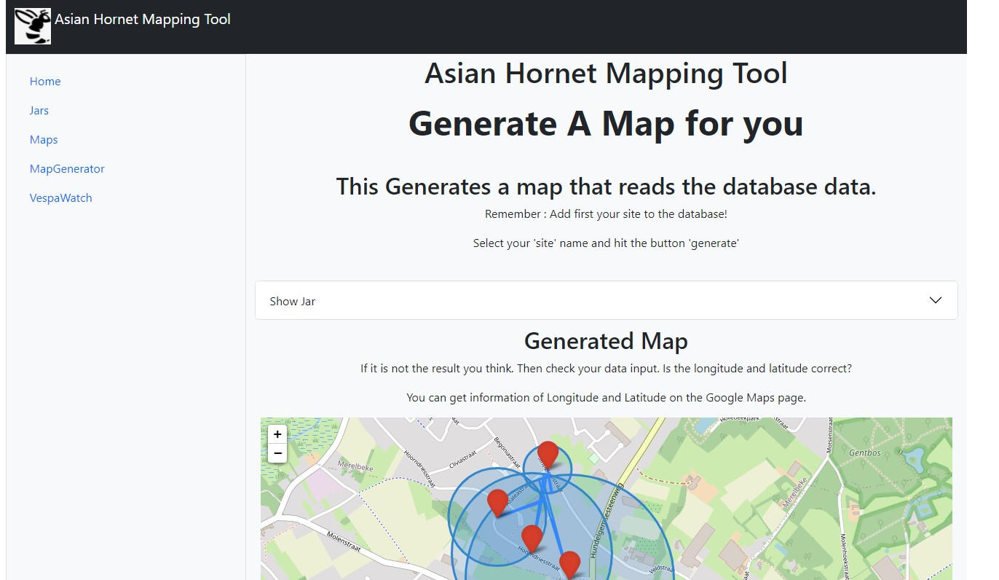

<p align="center">
  
</p>


#Welcome to the Asian Hornet Tracker tool

This project started as a necessity to track, monitor and create a 'tracking' map with the necessary data.

### Changes
- csv upload only possible with clear text
- added SQL Lite database
- added KISS frontend
- basic data CRUD operations (Add, Delete , Update)
- CRUD operations added to the tables - was only possible to select 
  the item inside the pop-up screen

## How does it work? 

Basically the following Python projects are in use:
- Python 3.x
- Flask
- Folium
- Pandas

And some modding is performed using a nice guys work : https://stackoverflow.com/questions/57227249/folium-how-can-i-change-fill-color-in-semicircle-plugin

## Install Instructions

> Install the latest version of Python
> for Windows users: go to the webpage of Python and follow the install instructions.
> Normally your system has already pip in it. 

> In terminal pip install the requirements file
> '''
> pip install -r requirements.txt
> '''
---
> Run the code by opening a cmd or terminal window. 
> '''
> python main.py 
> '''
> The above code should run the application locally (use the Dummy Data generators inside the folder structure to quicly start)

[//]: <> (Inserting Code)
```
inside the terminal: browse to your program folder.
 For windows user probably :> c:/User/something/downloads/... 
type:
python main.py

this should run the Flask server.
```
> click on the URL inside the terminal window.
> 
> open the http://127.0.0.1:5000
> 
> Then the webpage program opens, and you can use the application.

### Database Data

The Database is hidden. So booting the system requires a new database. Should be tested. It is a lite sql solution.

---

**jar** :  the name of the jar , can be a string (Just give it a name to remember)

**latitude**: You need to know the geolocation of the jar (I use Google maps and copy the information)

**longitude**: Same as above

**nr_of_sightings**: would be useful to know at which yar you have seen the most hornets.

**average_distance**: when measuring the flight time between departure and return, you known the distance (1 min = 100 meters)

**heading_direction**: for this you need a compass. :-) just add it in degrees.

---

With the forms you can edit and add information. 

---

### For now Run Instructions
> After installation of the requirements file. 
> 
> Run the python main.py.
> 
> A local 'web interface' is created.
> 
> Open the url = > http://127.0.0.1:5000
> 
> On the left is the menu to jump between jars and maps. The generator generates the map :-)
> 
> Every Jar or Map is a form where you can perform CRUD operations. 
> This means, that you can add, read, update and read information in the database. 
> I think that the "blocks" in the form are understandable. 

### Dummy Data generator

In the 'modules' folder you can find two scripts that help generate quickly some data around Ghent. Afterwards you can add observations to the cretaed jars. 


### Improvements?
There are the following improvments added:
- One class Map that generates a folium object containing linked information (observation linked to jar, jar linked to map)
- Better error handling and testing
- Generator for dummy data
- Better front-end with some Bootstrap items and minor javascripting for dynamic form filling.
- database has 3 tables : Maps, Jars, Observations

### Planned:
- Filtering on observations
- Filtering on Jars
- Nicer select for Jars or Observation - dynamically select on search field
- Plot a range of items on a Map (multiple jars without linking on a map)(Same for observations)
- Timelaps? Observations during a time period
- containerized application - Docker - then perform docker run "hornettracker"
  - Updates can be downloaded from the Docker website. Would be helpfull for CICD lines during development


Far Future: I guess it must be able to suggest a search area where two beams 'headings' cross... But this is out of my scope of knowledge today.


 
### Images





### Probably some issues for running locally
- Do you have enough rights on your machine?
- Have you read the installation instructions?
- Is the use of a local web server allowed on your machine? 
- Check if your firewall is not blocking port 5000
- Have you installed Python 3?


